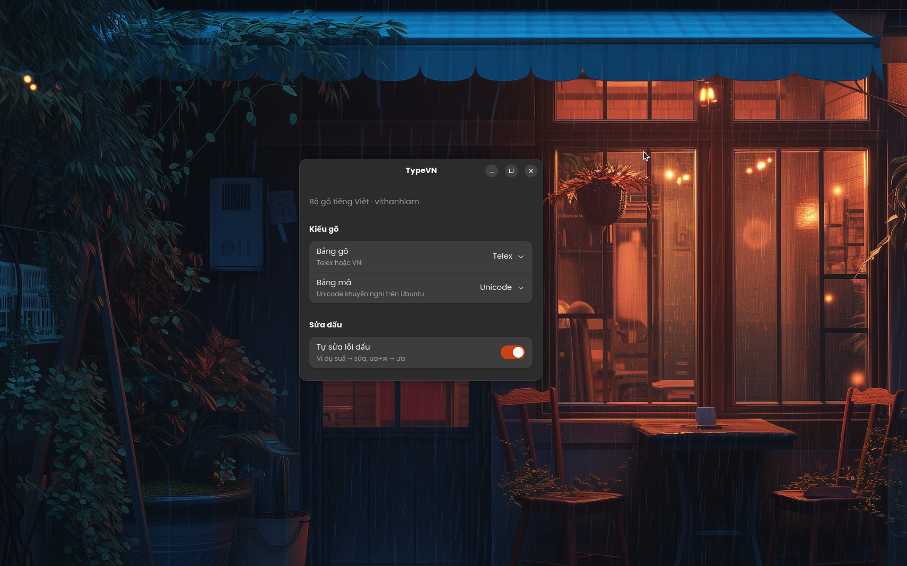

# Changelog

Mọi ngày theo giờ máy (UTC+7).

## 0.1.10 — 2026-08-22

- Đổi mô tả dưới tiêu đề thành `Bộ gõ tiếng Việt`.
- Hiển thị tác giả **Vi Văn Lâm** cùng link GitHub và lời cảm ơn cộng đồng.

## 0.1.9 — 2026-08-22

- Đổi mô tả đầu cửa sổ Settings thành `Bộ gõ tiếng Việt TypeVN`, bỏ tên author khỏi giao diện chính.

## 0.1.8 — 2026-08-22

Cải thiện ứng dụng cài đặt và kết nối cộng đồng.

- Hiển thị version hiện tại trong cửa sổ TypeVN Settings.
- Thêm link GitHub và lời cảm ơn những người đóng góp, phát triển TypeVN.
- Kiểm tra bản release mới trên GitHub ở background, không chặn giao diện.
- Hiển thị nút cập nhật khi GitHub có version mới hơn.

## 0.1.7 — 2026-08-22

Tách dữ liệu sửa lỗi khỏi code để cộng đồng có thể đóng góp dễ hơn.

- Thêm `data/macros.json` cho các macro sửa lỗi exact-match, ví dụ `Loix` → `Lỗi`.
- Hỗ trợ macro cá nhân tại `~/.config/typevn/macros.json`; macro cá nhân được ưu tiên.
- Thêm `src/repair.rs` làm nơi tập trung các sửa lỗi Telex cơ bản.
- Sửa lỗi tiền tố `tru` bị nhận nhầm là `true`, khiến `Truwa` và `Truowng` không hoạt động.
- Bổ sung test hồi quy và hướng dẫn đóng góp macro trong `CONTRIBUTING.md`.
- Giữ nguyên thông tin author và `Co-authored-by` để mọi contributor được ghi nhận.

## 0.1.6 — 2026-08-19

Đổi giấy phép **MIT** (GitHub) + làm sạch lịch sử git. Gói: **`ibus-typevn_0.1.6_amd64.deb`**, snap **`typevn`**.

- Giấy phép [MIT](LICENSE) — bản quyền vithanhlam.
- Snap **typevn** đã upload lên Snap Store; chờ Canonical duyệt classic confinement.
- [CONTRIBUTING.md](CONTRIBUTING.md): hướng dẫn mọi người tham gia phát triển (issue, PR).
- Lịch sử git chỉ còn author **vithanhlam**.

## 0.1.5 — 2026-08-18

Công tắc bật/tắt phím tắt trong app TypeVN. Gói: **`ibus-typevn_0.1.5_amd64.deb`**.

- **Bật phím tắt** (mặc định bật): Shift+Space, Ctrl+Shift+1/2, Ctrl+Alt+M/C/R hoạt động như trước.
- **Tắt phím tắt**: engine không nuốt phím; GNOME gỡ binding tùy chỉnh — dùng công tắc **Gõ tiếng Việt** trong app thay cho Shift+Space.

## 0.1.4 — 2026-08-17

Gõ từ tiếng Anh viết liền giữ nguyên như Unikey. Gói: **`ibus-typevn_0.1.4_amd64.deb`**.

- Không gắn dấu ngược khi vần không hợp lệ: `shieldpress`, `press`, `google`, `hello`, `server`, `cargo`…
- Kiểm tra phụ âm đầu (onset) và cụm nguyên âm (nucleus) trước khi gắn dấu — giống Unikey hơn.
- Tiếng Việt vẫn gõ bình thường: `tiếng`, `được`, `nguyễn`, `khuỷu`, `chuyện`…

## 0.1.3 — 2026-08-17

Sửa gõ chuỗi dài / gõ nhanh và phím tắt bị nhảy. Gói: **`ibus-typevn_0.1.3_amd64.deb`**.

- Chuỗi Latin viết liền giữ nguyên khi đã rõ không phải tiếng Việt: `wordpress`, `vithanhlamseo`, `wordpressplugin`.
- Từ dài hơn 32 ký tự không còn bị cắt: commit từng khúc và các khúc sau giữ nguyên chữ đã gõ.
- Phím tắt trên keypad nhận cả hai trạng thái NumLock (`Num 1` = `KP_End`/`KP_1`).
- Một lần bấm phím tắt chỉ đổi trạng thái một lần; `typevn-ctl` khóa file khi đọc/ghi cấu hình.
- Ghi `~/.config/typevn/config` bằng file tạm rồi thay tên, tránh đọc phải cấu hình dở.

## 0.1.2 — 2026-08-16

Phím tắt GNOME + app TypeVN. Gói: **`ibus-typevn_0.1.2_amd64.deb`**.

- App TypeVN: bật/tắt tiếng Việt, đổi Telex/VNI, tự gán phím tắt (GNOME custom shortcut + `typevn-ctl`).
- Shift+Space / Ctrl+Shift+1 / Ctrl+Shift+2 đăng ký với GNOME vì IBus Wayland không nhận được.

## 0.1.1 — 2026-08-16

Sửa cách gắn/hủy dấu cho gần Unikey. Gói: **`ibus-typevn_0.1.1_amd64.deb`**.

- Không gắn dấu ngược vào chữ đã gõ xong; chuỗi không nghĩa (không cách) giữ nguyên (`vithanhlamseo`).
- Hủy dấu: `uw` → `ư`, thêm `w` → `uw`; `ww` → `w`.

## 0.1.0 — 2026-08-16

Bản đầu tiên trên Ubuntu/GNOME Wayland. Tác giả: **vithanhlam**.

  

*Ảnh `TYPE.PNG`: cửa sổ cài đặt TypeVN (Telex, Unicode, tự sửa dấu đang bật; nền GNOME).*

### Engine (`typevn-core`)

- Telex: aa/aw/ee/oo/ow/uw/dd, dấu s/f/r/x/j, z bỏ dấu.
- VNI: 1–5 dấu, 6 â/ê/ô, 7 ă/ơ/ươ, 8 ư, 9 đ, 0 bỏ dấu.
- Đặt dấu: `gi`/`qu` là phụ âm (giúp, quá); `ua`/`ia` trên u/i (**của**, không cuả); `oa`/`oe`/`uy` kiểu mới (hoà, khoẻ, thuỷ).
- `ư`+`o` → ươ, `uo`/`ua`+`w` → ươ/ưa; `dd` không liền (dudowcj → được).
- Tự sửa dấu (bật mặc định): `uă` → ưa.
- Việt/Anh (**Shift+Space**); passthrough prefix kiểu `console`, `class`, `const`.
- Bảng mã: Unicode, VNI Windows, VIQR, TCVN3.
- Buffer tối đa 32 ký tự; backspace hoàn tác từng phím.
- Không I/O / thread / network trên mỗi keypress.

### IBus (`ibus-typevn`)

- Adapter mỏng: keyevent → `process_key` → preedit/commit.
- Preedit gạch chân, không commit xen kẽ (hết khoảng trống kiểu “ch ỉnh”).
- Shortcut hệ thống pass-through.
- Cài user-local qua `IBUS_COMPONENT_PATH`.

### Cài đặt & UX

- Ảnh thương hiệu / screenshot UI: **`TYPE.PNG`**.
- `./setup.sh` và gói **`ibus-typevn_0.1.2_amd64.deb`** (GitHub Releases).
- `typevn-settings` (GTK4/libadwaita): Telex/VNI, bảng mã, tự sửa dấu, tự bật khi đăng nhập.
- Autostart: `~/.config/autostart/typevn.desktop` (tắt/bật trong settings).

### Kiểm thử

- Unit Telex/VNI: tiếng, Việt, được, đường, của, giúp, chỉnh, sửa, phải, luật, việc, điều, không, những, ngoài, tuổi…
- Stress 100k / 10 triệu key; latency &lt; 1ms (smoke).
- Benchmark Criterion: 100k và 1M keypress.

### Chưa làm

- Tray indicator.
- Tray / chỉ báo trên thanh trạng thái.
- Tùy biến phím tắt trên GUI.
- Test tay đủ mọi app Electron/Qt.
